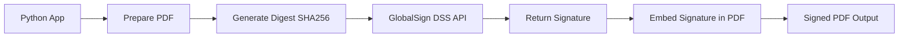
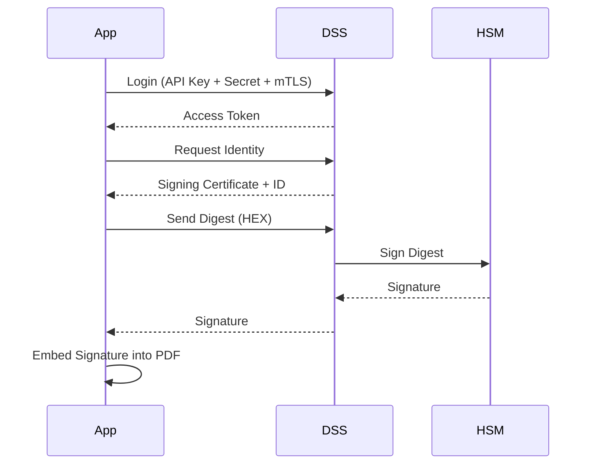
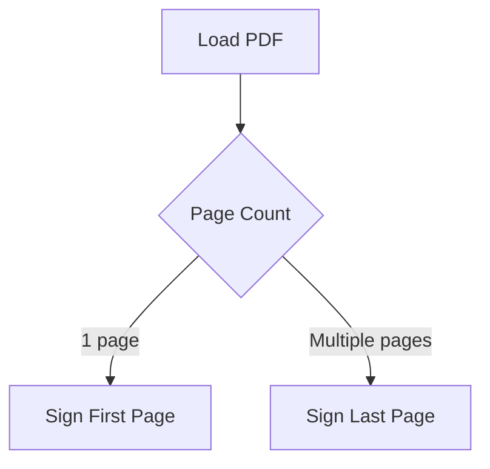
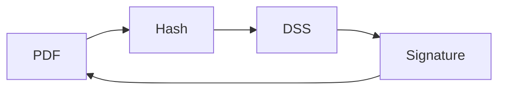

# GlobalSign DSS PDF Signing Integration (Python)

## Overview

This project demonstrates a **custom, fully self-managed PDF digital signing solution** using:

* **GlobalSign DSS (Digital Signing Service)** for secure remote signing
* **Python (pyHanko)** for PDF preparation and embedding signatures
* **mTLS + API authentication** for secure communication

This project demonstrates how GlobalSign DSS can be used or implemented. Using GlobalSign DSS eliminates reliance on third-party signing platforms (e.g., DocuSign, Adobe Sign) and enables **direct cryptographic signing workflows**.


## Objectives

* Enable **secure, standards-compliant PDF signing**
* Maintain **full control over signing workflows**
* Integrate directly with **GlobalSign DSS APIs**
* Support **multi-page document handling**
* Provide **extensible architecture for future enhancements (LTV, TSA, branding)**


## Background

### What is Digital Signing?

Digital signing ensures:

```text
 Integrity  → Document has not been altered
 Authenticity → Verified signer identity
 Non-repudiation → Signer cannot deny signing
```

### Key Concept

> The PDF is NOT sent to GlobalSign for signing.

Instead:

```text
PDF → HASH → DSS → SIGNATURE → PDF
```

This ensures:

* The document never leaves your system
* Private keys remain secure inside GlobalSign HSMs


## Architecture



---

## Security Model



### Key Security Points

* Private keys **never leave GlobalSign**
* Communication secured with **mTLS + Bearer Token**
* Only digest is transmitted (not full document)


## Implementation Logic

### Step 1: Authentication

```text
POST /v2/login
```

* Sends API key + secret
* Returns bearer token


### Step 2: Retrieve Signing Identity

```text
POST /v2/identity
Body: {}
```

Returns:

```json
{
  "id": "...",
  "signing_cert": "...",
  "ocsp_response": "..."
}
```


### Step 3: Prepare PDF

* Load PDF
* Detect page count
* Decide signature placement:

```text
1 page → first page
>1 pages → last page
```


### Step 4: Generate Digest

```text
SHA-256 hash of signing data
```


### Step 5: Request Signature

```text
GET /v2/identity/{id}/sign/{hex_digest}
```

Returns:

```json
{
  "signature": "HEX_SIGNATURE"
}
```


### Step 6: Embed Signature

Using pyHanko:

```text
- Create signature field
- Insert signature bytes
- Preserve PDF integrity
```


## Signature Placement Logic




## Core Components

### 1. GlobalSignDSSClient

Handles:

```text
 Authentication
 Identity retrieval
 Digest signing
```


### 2. GlobalSignPDFSigner

Acts as bridge:

```text
pyHanko → DSS
```

Responsibilities:

```text
 Hash data
 Send to DSS
 Return signature
```


### 3. PDF Signing Engine

```text
 Reads PDF
 Adds signature field
 Embeds cryptographic signature
```


## Data Flow




## Execution Flow

```text
1. User runs script
2. Script logs into DSS
3. Script retrieves identity
4. Script loads PDF
5. Script determines page placement
6. Script hashes data
7. DSS signs digest
8. Script embeds signature
9. Output file generated
```


## Current Capabilities

```text
 Remote signing via DSS
 Multi-page detection
 Visible signature field
 Secure mTLS authentication
 No third-party signing tools
```

---

## ⚠️ Current Limitations

```text
❌ No custom visual styling (depends on pyHanko version)
❌ No timestamp authority (TSA)
❌ No long-term validation (LTV)
❌ No embedded OCSP response
```


## Glossary

| Term   | Meaning                         |
| ------ | ------------------------------- |
| DSS    | Digital Signing Service         |
| mTLS   | Mutual TLS authentication       |
| Digest | Hash of data to be signed       |
| PKCS#7 | Standard for digital signatures |
| OCSP   | Online certificate validation   |
| LTV    | Long-term validation            |
| TSA    | Timestamp Authority             |


## Takeaways

This test implementation demonstrates a **production-grade digital signing architecture** that:

* Keeps sensitive cryptographic operations external (DSS)
* Maintains full application-level control
* Aligns with enterprise security and compliance standards

It forms a strong foundation for building:

```text
 Document signing platforms
 Contract automation systems
 Compliance workflows
 Secure document pipelines
```

